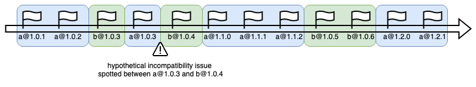

<div align="center">
    <center>
        
    </center>
</div>

# dependency-time-machine

Tool to automatically update dependencies one by one in chronological order. Most dependencies are compatible with other packages
from a similar time or pastime. This tool helps to find the latest compatible version of the dependencies and update them.

This tool is intended to simulate the typical updating workflow as it was done regularly.

## Installation
Run with npx to find the next recommended dependency to update:
```shell
npx dependency-time-machine --update --install
```

or install globally:
```shell
# npm
npm install -g dependency-time-machine

# yarn
yarn global add dependency-time-machine

# pnpm
pnpm add -g dependency-time-machine
```

## Usage
Basic usage to find the next recommended dependency to update:
```shell
npx dependency-time-machine --update --install
```

Automatically update dependencies one-by-one running tests after each update. Tests are run with the `npm test` command:
```shell
npx dependency-time-machine --update --install --auto
```

You can specify custom install and test commands:
```shell
npx dependency-time-machine --update --install --auto --install-script "yarn install" --test-script "yarn test"
```

Get a timeline of the updates in JSON format:
```shell
npx dependency-time-machine --timeline
```

To exclude some dependencies from the update, use the `--exclude` option:
```shell
npx dependency-time-machine --update --install --exclude react,react-dom
```

or use the `--exclude-file` option to exclude dependencies from the file:
```shell
npx dependency-time-machine --update --install --exclude-file exclude.txt
```

## Requirements
- Node.js >= 10

## How it works
The tool reads the `package.json` file and finds all dependencies. Then it resolves all the versions from the registry, sorts them by date and
finds the latest version of the dependency before finding another. Searching in version groups allows one to spot
incompatibility between dependencies. Built-in cache and auto mode allow to update dependencies faster.

<div style="text-align: center">
    
</div>

## Options
```shell
Usage: dependency-time-machine [options]

Tool to automatically update dependencies one-by-one in the time order

Options:
  -p, --packageFile <file>               Path to package.json file (default: "package.json")
  -u, --update                           Update package.json file with new versions
  -is, --install-script <command>        Install with script (default: "npm install")
  -ts, --test-script <command>           Test command (default: "npm test")
  -i, --install                          Install with script
  -t, --timeline                         Print timeline
  -a, --auto                             Run in auto mode
  -c, --cache                            Cache resolved dependencies
  -ans, --allow-non-semver               Allow non-semver versions (compare with dates then, experimental)
  -cf, --cache-file <file>               Cache file (default: "./.dependency-time-machine-cache.json")
  -e, --exclude <dependency>             Exclude dependency from update, separated by comma
  -r, --registry-url <url>               Registry url (default: "https://registry.npmjs.org")
  -x, --exclude-file <file>              Exclude dependencies from file, one per line (default: "")
  -shmn, --stop-if-higher-major-number   Stop if higher major number
  -shmnv, --stop-if-higher-minor-number  Stop if higher minor or major number
  -pi, --print-info                      Print info about the packages
  -h, --help                             display help for command
```

## License
MIT